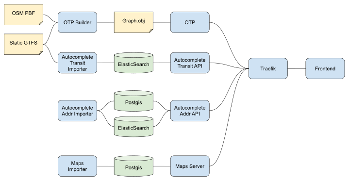

# Smart Mobility Planner

## General information

The **S**mart **MO**bility **P**lanner (*a.k.a* SMOP) is a **real-time, intermodal route planning solution** developed by the four belgian Public Transport Operators (PTOs), namely the [TEC](https://www.infotec.be/), [De Lijn](https://www.delijn.be/en/), [STIB-MIVB](https://www.stib-mivb.be/index.htm?l=en) and [SNCB-NMBS](https://www.belgiantrain.be/fr) together with [nextmoov](https://github.com/nextmoov/nextmoov) as technical partner.

One key objective of the SMOP was to build **a robust route planning solution (both in terms of functional scope and performance) that is backed-up solely by open-source technologies and data**. The selected route planning engine is [Open Trip Planner](https://www.opentripplanner.org/).

The SMOP pilot project was a winner of the [Smart Mobility Belgium](https://www.smartmobility-belgium.be/) call for ideas.

A comprehensive description of the project can be found [here](https://drive.google.com/file/d/1icQhfvu54ST9hkw7Xl02xk1zy3xnKsAZ/view?usp=sharing).

## Architecture



SMOP is composed of multiple services:

* Maps : [nextmoov-smop-maps](https://github.com/nextmoov/nextmoov-smop-maps)
* Autocomplete addresses : [nextmoov-smop-autocomplete-addr](https://github.com/nextmoov/nextmoov-smop-autocomplete-addr)
* Autocomplete transit : [nextmoov-smop-autocomplete-transit](https://github.com/nextmoov/nextmoov-smop-autocomplete-transit)
* OTP : [nextmoov-smop-otp](https://github.com/nextmoov/nextmoov-smop-otp)

And a demonstration frontend : [nextmoov-smop-frontend](https://github.com/nextmoov/nextmoov-smop-frontend)

You can get all the modules by using : `git submodule update --init`.

In each submodules you can find a `config.js` file where you can set the connection strings, by example. Take care to rebuild your Docker images if you change de configuration.

## Starting things

You can start the entire system or use each module independently or a mix of both, depending on your needs.  
You can customize the root `docker-compose.yml` file (commenting out what do not need) or run each module independently (they each have a their own docker-compose.yml file in their root folder).  

Note: you always need the reverse proxy for exposing endpoints

Everything was tested with :

```console
$ docker-compose -v
docker-compose version 1.21.0, build unknown
$ docker -v
Docker version 19.03.5, build 633a0ea838
```

### With OTP (aka With Route Planning)

WARNING: By default, on MAC/Windows Docker Desktop is restricted to not use too much RAM. OTP needs at peak 8GB of RAM/SWAP to run.

To have a system operational with OTP, you need to:

* To provide a OSM PBF file (See [Data sources](#data-sources)) in the directory `data` alongside the docker-compose.yml file.

* To provide static GTFS zip files (See [Data sources](#data-sources)) in the directory `data` alongside the docker-compose.yml file.

* The provided static GTFS files needs to be named `xxx-gtfs.zip` (where xxx is only composed of lower case letters).

* Build OTP (taking around 15 mins) : `docker-compose run otp-builder ./build`

Example of last line of the build, when it succeeds :
```console
13:49:26.629 INFO (GraphBuilder.java:153) Graph building took 15.1 minutes.
```

Then see [Without OTP](#without-otp-aka-without-route-planning).

### Without OTP (aka Without Route Planning)

To start the system, you need to : 

* Start everything : `docker-compose up`

## Using the services

All services will be accessible trough the reverse-proxy [Traefik 2](https://traefik.io/) on http://localhost:8080.

Only the OTP web interface is located at http://localhost:8081. 

See each services for more information about their API.

## Data sources

### Maps (aka OSM PBF)

The map data proposed are here : [Geofabriek - Download Belgium](http://download.geofabrik.de/europe/belgium.html)

### GTFS static

The consolidated GTFS file may be provided by [iRail - GTFS](https://gtfs.irail.be/)

### GTFS RT

To have access to the GTFS RT feeds from the public transport operators (PTOs) you need to subscribe to their services :

* [DeLijn](https://data.delijn.be/docs/services/)
* [SNCB / NMBS](https://www.belgiantrain.be/en/3rd-party-services/mobility-service-providers/public-data)
* [STIB / MIVB](https://opendata.stib-mivb.be/)
* TEC is currently working on feed accessible to everyone

### Villo!

JCDecaux provides an open API to get bikes availability, you can subscribe [here](https://developer.jcdecaux.com/#/opendata/vls?page=getstarted) to create an account.

"contracts" are the key related to a specific location:

* For Brussels : `contract=Bruxelles-Capitale`
* For Namur : `contract=Namur`
